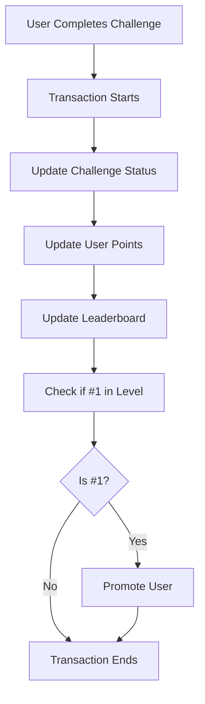
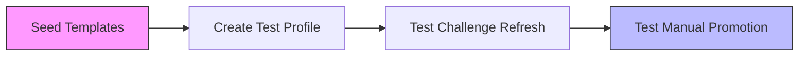

# Challenge Completion Flow

## Overview

The challenge completion system handles user progress, point distribution, and level promotions in an atomic and consistent manner. This document outlines the current implementation, its strengths, and potential future improvements.

## Flow Diagram



## Testing Flow



Available test endpoints:
1. `/seedChallengeTemplates` - Seeds initial challenge templates
2. `/seedUniversalChallenges` - Seeds initial universal challenges
3. `/completeUserProfile` - Creates a test user profile
4. `/triggerDailyChallengeRefresh` - Tests challenge refresh flow
5. `/manualUserLevelUp` - Tests promotion flow directly

## Key Strengths

1. **Atomic Operations**
   - All operations happen in a single transaction
   - No partial updates possible
   - Automatic rollback on failures

2. **Clear Testing Path**
   - Full suite of test endpoints
   - Environment-aware testing tools
   - Isolated test capabilities
   - Well-documented test flows

3. **Data Consistency**
   - Transaction-based updates
   - No race conditions
   - Clear error boundaries
   - Proper error handling

4. **Simple but Effective**
   - Clear, maintainable code
   - Easy to understand flow
   - Minimal complexity
   - Direct promotion checks

5. **Well Logged**
   - Comprehensive logging
   - Clear error messages
   - Operation tracking
   - Debug-friendly

## Edge Cases Handled

1. **Challenge Validation**
   - Already completed challenges
   - Invalid challenge IDs
   - Wrong user attempting completion
   - Max level reached (advanced)

2. **Points & Levels**
   - Points calculation accuracy
   - Level progression limits
   - Leaderboard position checks
   - Transaction rollback on errors

3. **Security**
   - Auth checks
   - Admin-only endpoints protected
   - User data isolation
   - Testing endpoints restricted to dev

## Potential Improvements

1. **Monitoring & Performance**
   ```typescript
   // Add performance monitoring
   const startTime = performance.now();
   // ... transaction ...
   const duration = performance.now() - startTime;
   logger.info(`Challenge completion took ${duration}ms`);
   ```

2. **Rate Limiting**
   ```typescript
   // Add rate limiting for challenge completions
   const rateLimitKey = `challenge-complete-${userId}`;
   const rateLimitDuration = 60; // seconds
   ```

3. **Retry Logic**
   ```typescript
   // Add retry logic for transient failures
   const maxRetries = 3;
   let attempt = 0;
   while (attempt < maxRetries) {
     try {
       // transaction
       break;
     } catch (error) {
       if (!isTransientError(error) || attempt === maxRetries - 1) throw error;
       attempt++;
       await delay(Math.pow(2, attempt) * 100); // exponential backoff
     }
   }
   ```

## Future Considerations

1. **Scaling**
   - Add caching for frequent operations
   - Implement batch processing for high load
   - Consider sharding for large user bases

2. **Monitoring**
   - Add detailed performance metrics
   - Implement alert thresholds
   - Track completion patterns

3. **User Experience**
   - Add progress notifications
   - Implement real-time updates
   - Add completion animations/feedback

4. **Resilience**
   - Implement circuit breakers
   - Add fallback mechanisms
   - Enhance error recovery

## Related Documentation
- [Points Distribution](./points-distribution.md)
- [Challenge Refresh Process](./challenge-refresh.md)
- [System Summary](./system-summary.md)