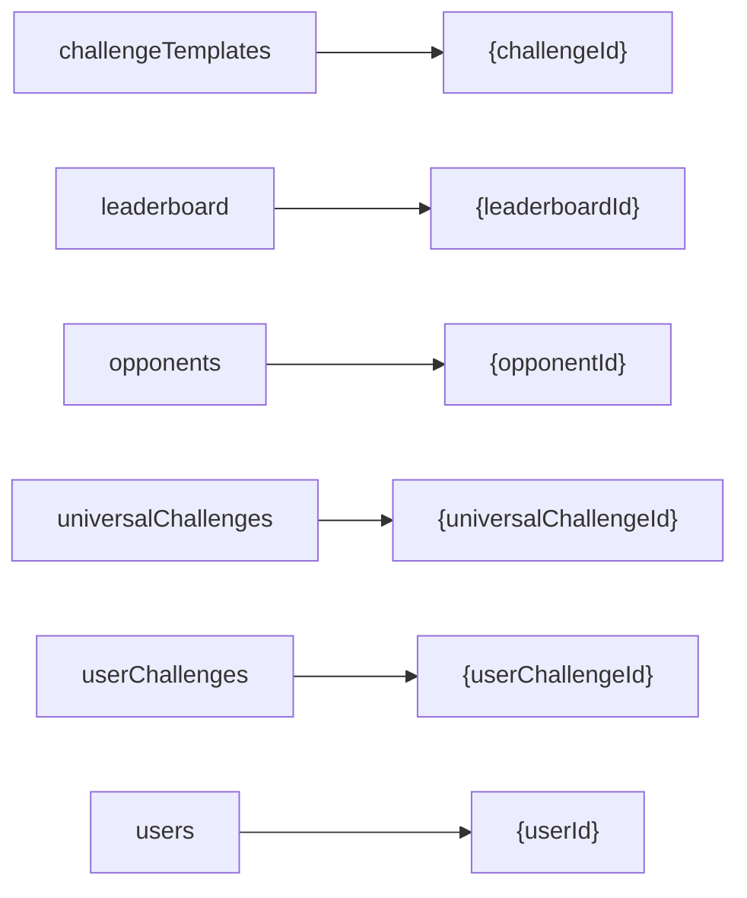

<!-- typesync-start -->

```mermaid
graph LR
    node1["challengeTemplates"] --> node2["{challengeId}"]
    node3["leaderboard"] --> node4["{leaderboardId}"]
    node5["opponents"] --> node6["{opponentId}"]
    node7["universalChallenges"] --> node8["{universalChallengeId}"]
    node9["userChallenges"] --> node10["{userChallengeId}"]
    node11["users"] --> node12["{userId}"]
```
<!-- typesync-end -->
